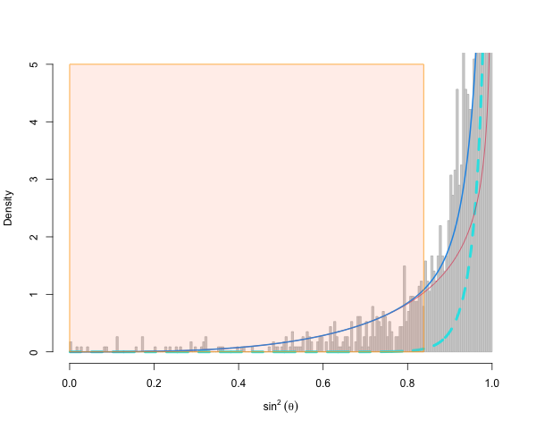
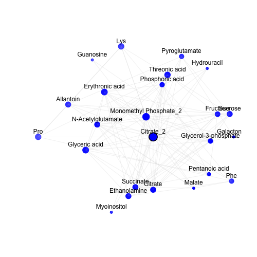
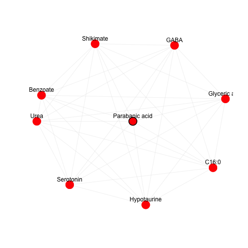
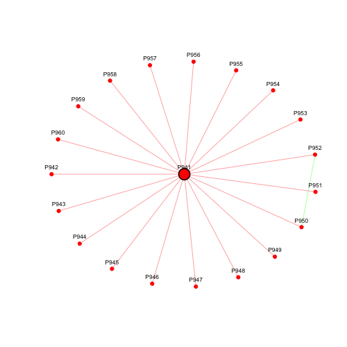

```{r setup, include = FALSE}
knitr::opts_chunk$set(
  collapse = TRUE,
  comment = "#>"
)
```


The betaMix package is used to find edges in gene networks using co-expression data. The betaMix method is built on the insightful results of [@Frankl1990] who showed that two random vectors are approximately perpendicular with high probability, if the dimension of the space is sufficiently large. The pair-wise correlations between pairs of predictors are equal to the cosine of the angles between the pairs. From these angles we compute $z_j=\sin^2(\theta)$ and fit a mixture of two beta distributions. For pairs of random vectors (the null set) the distribution of $z_j$ is Beta((N-1)/2, 1/2), where N is the sample size. The nonnull set is assumed to follow a Beta(a,b) distribution, and using the EM algorithm we estimate a,b, and the proportion, p0, of the null set of pairs. The betaMix function determines a threshold which will control the error rate given by the user. Any $z_j$ below that threshold corresponds to a significantly correlated pair of predictors (an edge in the graphical model.)
If the N samples can be assumed to be independent, set the parameter `ind` to `TRUE` (the default). If it is set to `FALSE`, the null set follows a Beta((nu-1)/2, 1/2) distribution and nu (the effective sample size) is estimated from the data.

By default, betaMix uses Pearson's correlation to measure linear association between predictors. If the relationships of interest are monotone but not necessarily linear, Spearman's rank correlation can be requested via `method = "spearman"`. Both methods produce a $z_j$ statistic in $(0, 1)$ and are handled identically by the EM algorithm; the only difference is how the pairwise correlations are computed (Spearman computes Pearson's correlation on the column ranks). The chosen method is stored in the returned list as `$method`.

The input to the program is a normalized expression matrix, with predictors/genes (which are the nodes in the graph) in the columns, and samples in the rows.

With a large number of predictors, P, the estimation may be slow, so it is recommended to set the parameter `subsamplesize` to something smaller than `choose(P,2)`. The minimum allowed by the program is 20,000; using anything smaller will cause betaMix to fit the model to all `choose(P,2)` pairs.

The betaMix package depends on the 'Matrix' package, to allow for efficient storage and computation of large co-occurrence matrices. If P is very large, the correlation matrix may require an unattainable amount of memory. For such cases, the betaMix package has a procedure to store the correlation data in a SQLite database, thus never loading more than two columns into memory. For this purpose, the package depends on DBI and RSQLite. For the EM algorithm, betaMix requires the nleqslv package.


# Real data examples

We use metabolomic profile data from the [Metabolomics Workbench](https://www.metabolomicsworkbench.org) website, Study ID ST000561. The data was introduced and analyzed in [@tomatos2017] and like their analysis we focus on 68 named metabolites. In the study, there are two groups of seeds - dry, and 6 hours imbibed. Each one has 50 samples, so P=68, N=50. We construct the network for each group separately. For example, for the dry-seed group we do the following:

```
library("betaMix")
data(DrySeeds)
res1 <- betaMix(DrySeeds, ind=T) # the samples can be assumed to be independent.
plotFittedBetaMix(res1)
```

Note that we've used the ind=T option, since the 50 samples can be assumed to be independent. The fitted mixture model is shown below. The red line is the non-null component, and the green (solid) line is the null component under the independent sample assumption. If the model is fitted with ind=F, the effective sample size is estimated, and the null component is represented by the dashed line. The blue curve represents the mixture. The orange region shows the range of $z_j$'s which are determined to be significant.


```{r echo=FALSE, out.width='60%'}

```

We now show how to summarize and visualize the results. For example, the following graphComponents code is used to create clusters of metabolites. The function summarizeClusters shows the number of nodes, edges, clusters, unclustered nodes, and summary statistics on the clusters. See the package's documentation for more detail.

```
adjMat1 <- getAdjMat(res1)
graphComp1 <- graphComponents(adjMat1,minCtr = 2,type=1)
head(summarizeClusters(graphComp1))
plotCluster(adjMat1, 1, graphComp1, labels=TRUE, nodecol = "blue")
```


```
Num of nodes: 68
Num of edges: 323
Num of clusters: 6
Num of unclustered nodes: 13
     Cluster Nodes degreeMin degreeQ25 degreeMedian degreeQ75 degreeMax pctInClstMin pctInClstQ25
[1,]       1    24         4      11.5         15.0      16.0        23    0.3125000    0.4833333
[2,]       2    13         8      13.0         16.0      18.0        19    0.5555556    0.6153846
[3,]       3     4         5       6.0          7.5       9.0        10    0.1428571    0.1964286
[4,]       4     4         2       3.5          6.5       8.5          9    0.2500000    0.2916667
[5,]       5     6         4       4.0          5.0       6.0          7    0.5000000    0.7142857
[6,]       6     4         2       2.5          3.5       4.5          5    0.2500000    0.4250000
```

A depiction of the first cluster is obtained by using the function plotCluster:

```{r echo=FALSE, out.width='50%'}

```

We can do the same for the SixHourImbibed dataset:

```
library("betaMix")
data(SixHourImbibed)
res2 <- betaMix(SixHourImbibed,ind=T)
plotFittedBetaMix(res2)
adjMat2 <- getAdjMat(res2)
graphComp2 <- graphComponents(adjMat2,minCtr = 2,type=1)
summarizeClusters(graphComp2)
plotCluster(adjMat2, 3, graphComp2, labels=TRUE, nodecol = "red")
```

```
Num of nodes: 68
Num of edges: 251
Num of clusters: 7
Num of unclustered nodes: 11
```


```{r echo=FALSE, out.width='50%'}

```


# Simulated data

The following examples shows a simulated dataset (called SIM) with a hub structure, consisting of 1000 nodes (columns) and 50 hubs. In this case P=1000, which means that the number of putative edges is 499,500 so we use the subsamplesize = 30000 option. Also, because there are almost half a million tests, we set maxalpha=1e-6 to have a proper control of the error rate. The ppr parameter is the Bayesian version of controlling the error rate by limiting the posterior probability rate.

We want to plot the clusters and distinguish between positive and negative correlations. We use the signed=TRUE option in the getAdjMat function. Then, in plotCluster we can specify the colors which will be used to display significant edges, by the sign of the correlations.

```
data(SIM)
Simres <- betaMix(SIM, subsamplesize = 30000, ind=TRUE, maxalpha=1e-6, ppr=0.01)
plotFittedBetaMix(Simres)
SimadjMat <- getAdjMat(Simres,signed=TRUE)
SimgraphComp <- graphComponents(SimadjMat,minCtr = 2,type=1)
summarizeClusters(SimgraphComp)
plotCluster(SimadjMat, 1, SimgraphComp, labels=TRUE, nodecol = "red", edgecols = c("green","red"), labelsize = 0.7)
```

```
Num of nodes: 1000
Num of edges: 775
Num of clusters: 50
Num of unclustered nodes: 206
```

We  display the network of cluster 1, which shows that betaMix detects the correct cluster (hub) structure.

```{r echo=FALSE, out.width='45%'}

```

# Automated PDF Report

The `betaMixReport()` function runs the full pipeline and renders a
self-contained PDF report in one call. The report includes a dataset overview,
summary statistics, a 2×2 goodness-of-fit diagnostic panel (`assessFit()`),
a model-based ROC curve with the Youden-index threshold (`plotROC()`), and
all standard network plots (degree vs. clustering coefficient, adjacency
bitmap, and a representative cluster network).

```
library("betaMix")
data(DrySeeds)
betaMixReport(DrySeeds,
              dataset_name = "DrySeeds",
              output_dir   = "reports",
              ind          = TRUE)
```

The PDF is written to `reports/betaMix_DrySeeds.pdf` (the directory is created
automatically if it does not exist). Key options mirror those of `betaMix()`:
`ind`, `maxalpha`, `ppr`, `method` (`"pearson"` or `"spearman"`), and
`subsamplesize`. The `signed` argument passes signed edges to the cluster
network plot, and `rep_cluster` lets you override the automatically chosen
cluster.

# Goodness-of-fit assessment

After fitting the model, `assessFit()` produces a 2×2 diagnostic panel and a
printed verdict describing how well the two-component Beta mixture fits the
data.

```
assessFit(res1)
```

The four panels are:

1. **Fitted mixture** — the standard histogram overlay with null component
   (green dashed), non-null component (red), mixture (blue), and the orange
   significance region.
2. **Null Q-Q plot** — *pure-null* observations ($m_0 \geq 0.9$ by default)
   vs $\text{Beta}(\hat{\eta}, 0.5)$ **conditional on** the sub-range spanned
   by those observations. By restricting to the upper tail of the null
   distribution (small correlations, $z_{ij}$ near 1), where the posterior
   probability of being null is high, contamination from the overlap with the
   non-null component is excluded. Points are blue when the conditional KS $D$
   statistic is $\leq 0.05$ (good fit) and red otherwise. A notable departure
   may indicate dependent samples; try `ind = FALSE` in that case. Falls back
   to all $m_0 \geq 0.5$ observations if fewer than 10 pass the threshold.
3. **Non-null Q-Q plot** — *pure-non-null* observations ($m_0 \leq 0.1$ by
   default), scaled by $b_{\max}$, vs $\text{Beta}(\hat{a}, \hat{b})$
   **conditional on** the sub-range of those observations. Restricting to the
   lower tail (high correlations, small $z_{ij}/b_{\max}$) removes the
   right-side overlap where the null component dominates. Because the non-null
   Beta is a convenience model, deviations in the overlap region do not affect
   inference; this conditional Q-Q focuses on the region that does. Falls back
   to all $m_0 < 0.5$ observations if fewer than 10 pass.
4. **Model-based ROC curve** — sweeps $\tau$ from 0 to 1 using the fitted
   Beta distributions. The orange point marks the current threshold; the red
   point marks the Youden-index optimum $\tau^* = \arg\max_\tau [\text{TPR}(\tau) -
   \text{FPR}(\tau)]$.  The AUC summarises overall separability.

The printed assessment reports KS $D$ for both hard-assigned and pure-subset
conditional tests, the number of detected modes, and an overall verdict
(`"Good fit"`, `"Acceptable fit"`, or `"Deviations detected"`). The D
statistic threshold is 0.05; raw p-values are not used because with tens of
thousands of pairs even $D \approx 0.01$ yields $p \approx 0$.

The `qq_purity` argument (default 0.9) controls the posterior probability
threshold. A higher value gives a purer but smaller sample for each Q-Q panel;
lower values include more of the overlap region.

## Model-based ROC curve

The ROC curve is now embedded in the bottom-right panel of `assessFit()`.
For standalone use, `plotROC()` produces the same plot and additionally
returns the AUC and Youden-index threshold:

```
roc <- plotROC(res1)
roc$auc            # overall separability
roc$tau_youden     # Youden-index optimal threshold
```

The **Youden index** threshold $\tau^* = \arg\max_\tau [\text{TPR}(\tau) -
\text{FPR}(\tau)]$ maximises the sum of sensitivity and specificity and can
be passed to `getAdjMat()` if a different operating point is desired:

```
adjMat_youden <- getAdjMat(res1, ppthr = roc$tau_youden)
```

The AUC summarises the overall separability of the two components: AUC close
to 1 means the null and non-null distributions barely overlap; AUC near 0.5
means they are almost indistinguishable at any threshold.

To view the non-null kernel density plot separately (formerly panel 4 of
`assessFit()`), use `plotNonNullDensity()`.

# Using Spearman's rank correlation

Spearman's correlation is recommended when the relationships between predictors are monotone but not linear. To use it, pass `method = "spearman"` to `betaMix()`. No other changes to the workflow are needed.

```
data(DrySeeds)
res_spearman <- betaMix(DrySeeds, ind = TRUE, method = "spearman")
res_spearman$method   # "spearman"
adjMat_s <- getAdjMat(res_spearman)
graphComp_s <- graphComponents(adjMat_s, minCtr = 2, type = 1)
summarizeClusters(graphComp_s)
```

For the file-backed path (very large P), the same `method` argument is forwarded to `calcCorr()`, which ranks each column in place before the Pearson standardisation step, giving exact Spearman correlations without loading the full matrix into memory.

# References
