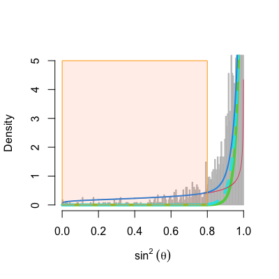
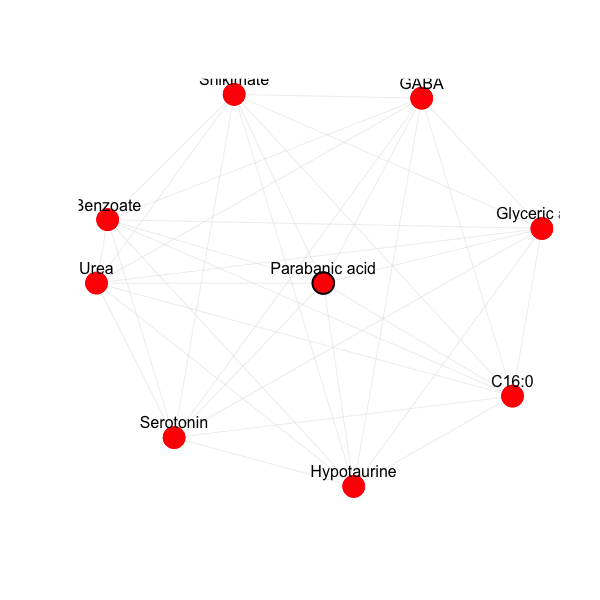
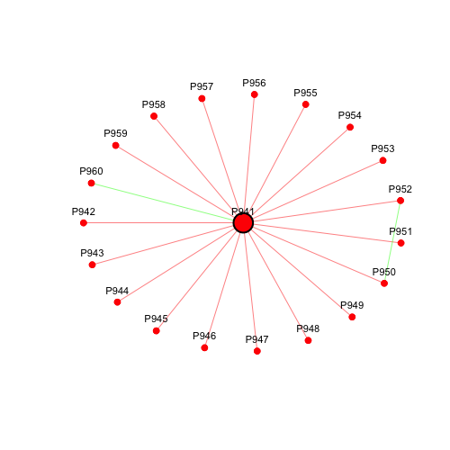

```{r setup, include = FALSE}
knitr::opts_chunk$set(
  collapse = TRUE,
  comment = "#>"
)
```


The betaMix package is used to find edges in gene networks using co-expression data. The betaMix method is built on the insightful results of [@Frankl1990] who showed that two random vectors are approximately perpendicular with high probability, if the dimension of the space is sufficiently large. The pair-wise correlations between pairs of predictors are equal to the cosine of the angles between the pairs. From these angles we compute $z_j=\sin^2(\theta)$ and fit a mixture of two beta distributions. For pairs of random vectors (the null set) the distribution of $z_j$ is Beta((N-1)/2, 1/2), where N is the sample size. The nonnull set is assumed to follow a Beta(a,b) distribution, and using the EM algorithm we estimate a,b, and the proportion, p0, of the null set of pairs. The betaMix function determines a threshold which will control the error rate given by the user. Any $z_j$ below that threshold corresponds to a significantly correlated pair of predictors (an edge in the graphical model.)
If the N samples can be assumed to be independent, set the parameter ind to TRUE. If it is set to FALSE (the default), the null set follows a Beta((nu-1)/2, 1/2) distribution and nu (the effective sample size) is estimated from the data.

The input to the program is a normalized expression matrix, with predictors/genes (which are the nodes in the graph) in the columns, and samples in the rows.

With a large number of predictors, P, the estimation may be slow, so it is recommended to set the parameter subsamplesize to something smaller than choose(P,2). The minimum allowed by the program is 20,000. Using anything smaller will cause betaMix to fit the model to all choose(P,2) pairs. 

The betaMix package depends on the 'Matrix' package, to allow for efficient storage and computation of large co-occurrence matrices. If P is very large, the correlation matrix may require an unattainable amount of memory. For suc cases, the betaMix package has a procedure to store the correlation data in a SQLite database, thus never loading more than two columns into memory. For this purpose, the package depends on DBI and RSQLite. For the EM algorithm, betaMix requires the nleqslv package.


# Real data examples

We use metabolomic profile data from the www.metabolomicsworkbench.org website, Study ID ST000561. The data was introduced and analyzed in [@tomatos2017] and like their analysis we focus on 68 named metabolites. In the study, there are two groups of seeds - dry, and 6 hours imbibed. Each one has 50 samples, so P=68, N=50. We construct the network for each group separately. For example, for the dry-seed group we do the following:

```
library("betaMix")
data(DrySeeds)
res1 <- betaMix(DrySeeds, ind=T) # the samples can be assumed to be independent.
plotFittedBetaMix(res1)
```

Note that we've used the ind=T option, since the 50 samples can be assumed to be independent. The fitted mixture model is shown below. The red line is the non-null component, and the green (solid) line is the null component under the independent sample assumption. If the model is fitted with ind=F, the effective sample size is estimated, and the null component is represented by the dashed line. The blue curve represents the mixture. The orange region shows the range of $z_j$'s which are determined to be significant.


```{r echo=FALSE, out.width='60%'}

```

We now show how to summarize and visualize the results. For example, the following graphComponents code is used to create clusters of metabolites. The function summarizeClusters shows the number of nodes, edges, clusters, unclustered nodes, and summary statistics on the clusters. See the package's documentation for more detail.

```
adjMat1 <- getAdjMat(res1)
graphComp1 <- graphComponents(adjMat1,minCtr = 2,type=1)
head(summarizeClusters(graphComp1))
plotCluster(adjMat1, 3, graphComp1, labels=TRUE, nodecol = "blue")
```


```
Num of nodes: 68 
Num of edges: 236 
Num of clusters: 3 
Num of unclustered nodes: 27 
     Cluster Nodes degreeMin degreeQ25 degreeMedian degreeQ75 degreeMax pctInClstMin pctInClstQ25
[1,]       1    17         5        10           12        14        16    0.4444444    0.9090909
[2,]       2    17         4         6           10        12        16    0.5000000    0.6666667
[3,]       3     7         3         4            5         5         6    0.6666667    0.9000000
```

A depiction of the third cluster is obtained by using the function plotCluster:

```{r echo=FALSE, out.width='50%'}

```

We can do the same for the SixHourImbibed dataset:

```
library("betaMix")
data(SixHourImbibed)
res2 <- betaMix(SixHourImbibed,ind=T)
plotFittedBetaMix(res2)
adjMat2 <- getAdjMat(res1)
graphComp2 <- graphComponents(adjMat2,minCtr = 2,type=1)
summarizeClusters(graphComp2)
plotCluster(adjMat2, 3, graphComp2, labels=TRUE, nodecol = "red")
```


```{r echo=FALSE, out.width='50%'}

```


# Simulated data

The following examples shows a simulated dataset (called SIM) with a hub structure, consisting of 1000 nodes (columns) and 50 hubs. In this case P=1000, which means that the number of putative edges is 499,500 so we use the subsamplesize = 30000 option. Also, because there are almost half a million tests, we set maxalpha=1e-6 to have a proper control of the error rate. The ppr parameter is the Bayesian version of controlling the error rate by limiting the posterior probability rate.

We want to plot the clusters and distinguish between positive and negative correlations. We use the signed=TRUE option in the getAdjMat function. Then, in plotCluster we can specify the colors which will be used to display significant edges, by the sign of the correlations.

```
data(SIM)
Simres <- betaMix(SIM, subsamplesize = 30000, ind=TRUE, maxalpha=1e-6, ppr=0.01)
plotFittedBetaMix(Simres)
SimadjMat <- getAdjMat(Simres,signed=TRUE)
SimgraphComp <- graphComponents(SimadjMat,minCtr = 2,type=1)
summarizeClusters(SimgraphComp)
plotCluster(SimadjMat, 1, SimgraphComp, labels=TRUE, nodecol = "red", edgecols = c("green","red"), labelsize = 0.7)
```

We  display the network of cluster 1, which shows that betaMix detects the correct cluster (hub) structure.

```{r echo=FALSE, out.width='45%'}

```

# References
